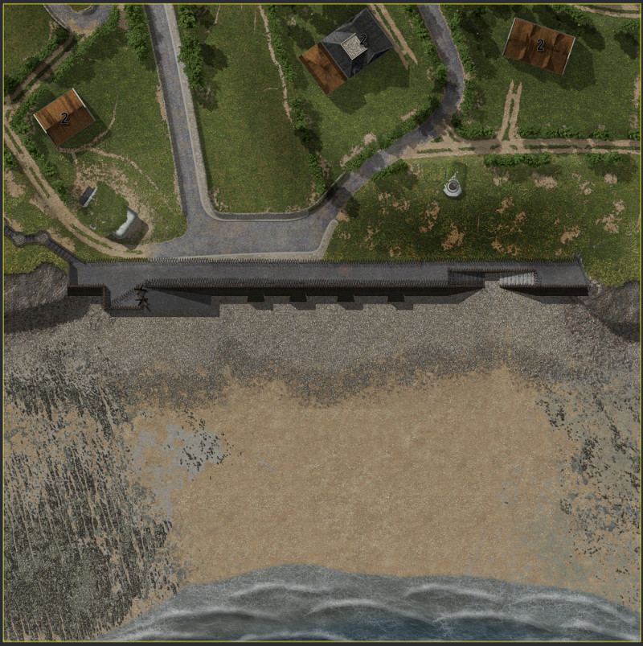
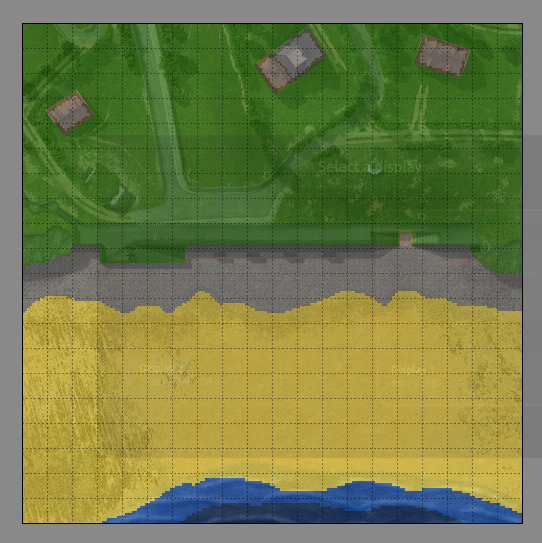
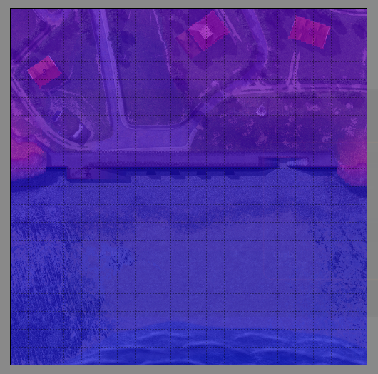
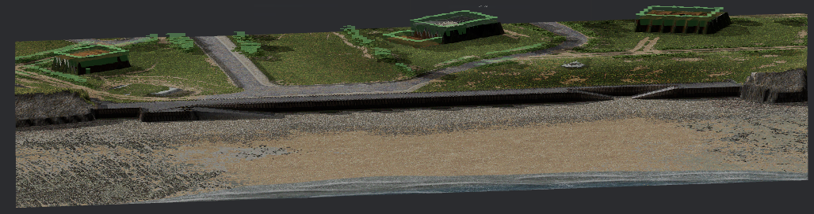

# Map

## Files

A map is a folder composed of:

- `background.png`: map background image
- `height.png`: tileset image of height gradients
- `height.tsx`: [Tiled](https://doc.mapeditor.org/en/stable/reference/tmx-map-format/) tileset file of height tileset
- `interiors.png`: map background image containing only building interiors
- `meta.toml`: map configurations
- `terrain.png`: tileset image of terrain types
- `terrain.tsx`: [Tiled](https://doc.mapeditor.org/en/stable/reference/tmx-map-format/) tileset file of terrain types
- `trees.png`: tileset image of "on the top" vegetation
- `trees.tsx`: [Tiled](https://doc.mapeditor.org/en/stable/reference/tmx-map-format/) tileset file of "on the top" vegetation
- `world.tmx`: [Tiled](https://doc.mapeditor.org/en/stable/reference/tmx-map-format/) map file of the map

## Resume

A map is based on the [Tiled](https://doc.mapeditor.org/en/stable/reference/tmx-map-format/) map format and use tileset mechanisms. It is not the most appropriate format but permit "quick" map creation and edition using the Tiled software.

A map is composed by:

- A background image, which is draw at the bottom
- A grid of "terrain" tile, composed by `terrain` tileset, to specify terrain nature
- A grid of "height" tile, composed by `height` tileset, to specify the z axis of terrain
- A grid of "decor" tile, composed by `trees` tileset, to specify the "on the top" vegetation / decor
- An objet layer "interior_zones", to indicate which zone must display "interiors.png" part when soldier in it
- An objet layer "spawn_zones", to indicate map split and enable/disable zones in deployment phase
- An objet layer "flags", tu indicate placement of flags to capture

## CLI helpers

To help to initialize or update with recent tileset a map, you can use the `world` command:

```
Usage: world [OPTIONS] <PATH>

Arguments:
  <PATH>  Folder which contain (or already contain) world

Options:
      --mod <MOD>                  Path to the mod folder (required if snapshot used)
      --snapshot <SNAPSHOT>        File path to the snapshot file to initialize
      --width <WIDTH>              World width in tiles (required if initializing new world)
      --height <HEIGHT>            World height in tiles (required if initializing new world)
      --tile-size <TILE_SIZE>      Tile size (in pixel) [default: 5]
      --terrain-tsx <TERRAIN_TSX>  Terrain tsx source file
      --terrain-png <TERRAIN_PNG>  Terrain png source file
      --trees-tsx <TREES_TSX>      Trees tsx source file
      --trees-png <TREES_PNG>      Trees png source file
  -v, --verbose                    Print analysis informations
      --replace                    Replace files like terrain.tsx, snaphost, etc
  -h, --help                       Print help
  -V, --version                    Print version
```

## In images





